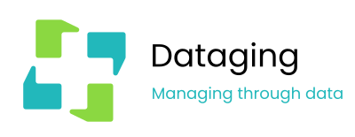

# Seminario de introducción a Python

Seminario de **dos sesiones de 3 horas** para personas que **nunca han programado**: parte de qué es un programa y termina analizando datos reales con pandas y leyéndolos de una base de datos. Todo el recorrido sigue el caso **FraSoHome**, una cadena de tiendas de muebles y decoración con sus datos (y sus errores) reales.

**[Empieza aquí: portada del seminario →](docs/README.md)**

## Las dos sesiones

| Sesión | Contenido |
|---|---|
| [Sesión 1 · De cero a tu primer programa](docs/sesion-1/README.md) | Qué es programar, cómo ejecuta el ordenador un programa (compilado frente a interpretado), instalación de Python, VS Code y Git, terminal, tipos de datos, variables, `input`, decisiones y errores |
| [Sesión 2 · Del programa a los datos](docs/sesion-2/README.md) | Listas, bucles y funciones, Markdown, Git y GitHub, entornos virtuales, notebooks, NumPy, pandas con el catálogo de FraSoHome y conexión con su base de datos |

También tienes un [glosario](docs/glosario.md) y [anexos](docs/anexos/README.md) con guías de instalación detalladas y solución de problemas.

## Estructura

| Ruta | Contenido |
|---|---|
| `docs/` | Todo el material del alumno, en Markdown. Es también la fuente de la web del seminario |
| `docs/sesion-*/ejemplos/` | Programas de ejemplo de cada sesión |
| `docs/sesion-2/datos/` | Datos de FraSoHome (`productos.csv`, `tiendas.csv`) |
| `docs/sesion-2/requirements.txt` | Paquetes del entorno del alumno |
| `mkdocs.yml` | Configuración de la web (MkDocs Material) |
| `.devcontainer/` | Entorno para GitHub Codespaces, el plan B si falla la instalación local |

## Ver la web en local

```bash
pip install mkdocs-material
mkdocs serve
```

Y abre `http://127.0.0.1:8000`.

## Versiones anteriores

El material del curso 2025-26 (fundamentos genéricos y notebooks sobre Sakila) se conserva en la etiqueta [`intro-python-2025-26`](https://github.com/antoniosql/materiales-cursos/tree/intro-python-2025-26/Intro-Python). Los notebooks de análisis continúan en [Python-Analitica](../Python-Analitica/).

## Licencia

Materiales bajo licencia [MIT](LICENSE).
