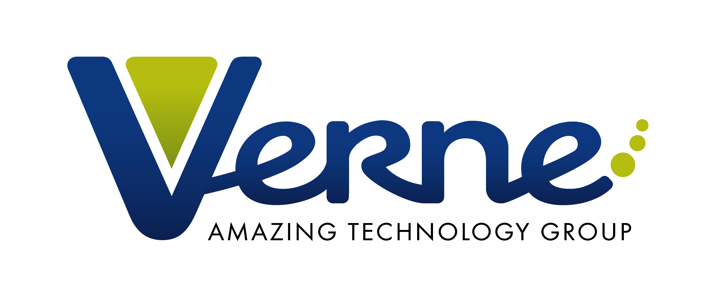

# Desarrollo de Soluciones con Machine Learning

¿Qué sabes de Machine Learning? ¿Conoces sus aplicaciones y cómo funciona? ¿Te gustaría aprender sus fundamentos y cómo aplicarlo en tu negocio? 
Machine Learning ha llegado para quedarse y su aplicación se está extendiendo cada vez más y en diversos sectores: banca, medicina, automoción, predicción de stocks, ventas, telecomunicaciones…  

## Objetivos

Los objetivos de este curso son introducir al alumno en el mundo del Machine Learning para que sepa diferenciar que problemas de negocio son susceptibles de ser resueltos mediante algoritmos de ML, como asociar cada tipo de problema con el algoritmo apropiado y como preparar los datos para sacar los mejores resultados de esos algoritmos. Todo ello desde un punto de vista práctico, sencillo y utilizando ejemplos reales. 

## Agenda
1.	Introducción a Machine Learning
    - ¿Qué es Machine Learning?
    - Tipos de problemas que resuelve
    - Ciclo de vida de un proyecto ML
2.	Requisitos de datos
    - Exploración de datos
    - Preparación de datos
3.	Entendiendo los Algoritmos de Machine Learning
    - Clasificación
    - Regresión
    - Clustering
    - Anomalías
    - Recomendaciones
4.	Ingeniería de Características
    - Técnica de generación de características
    - Selección de Características
5.	Técnicas Avanzadas
    - Optimización de hiperparámetros
    - Validación Cruzada
    - Reducción de dimensionalidad
6.	Despliegue y Mantenimiento
7.  Interpretabilidad de Modelos de ML

## Demostraciones por módulo

Cada demo de [demos/](demos/) está numerada según el módulo de la agenda al que
corresponde.

| Módulo | Demo | Contenido |
|---|---|---|
| 1 | [Demo 01-A El Primer Algoritmo Affairs](<demos/Demo 01-A El Primer Algoritmo Affairs.ipynb>) | Recorrido completo de un problema de ML de principio a fin |
| 2 | [Demo 02 Trabajo con Variables](<demos/Demo 02 Trabajo con Variables.ipynb>) | Tipos de variables y su tratamiento |
| 2 | [Demo 02-A EDA Inicial](<demos/Demo 02-A EDA Inicial.ipynb>) | Exploración inicial de un dataset |
| 2 | [Demo 02-B Nulos y repetidos](<demos/Demo 02-B Nulos y repetidos.ipynb>) | Imputación de nulos y eliminación de duplicados |
| 2 | [Demo 02-C Escalado de Características](<demos/Demo 02-C Escalado de Caracteristicas.ipynb>) | Normalización y estandarización |
| 2 | [Demo 02-D Codificación de Variables](<demos/Demo 02-D Codificacion de Variables.ipynb>) | Tratamiento de variables categóricas |
| 3 | [Demo 03-B Train y Test](<demos/Demo 03-B Train y Test.ipynb>) | Partición de datos y fuga de información |
| 3 | [Demo 03-C Algoritmos de Regresión](<demos/Demo 03-C Algoritmos de Regresion.ipynb>) | Modelos de regresión y sus métricas |
| 3 | [Demo 03-D Algoritmos de Clasificación](<demos/Demo 03-D Algoritmos de Clasificación.ipynb>) | Modelos de clasificación y matriz de confusión |
| 3 | [Demo 03-D2 Ensemble Learning](<demos/Demo 03-D2 Ensemble Learning.ipynb>) | Bagging, boosting y random forest |
| 3 | [Demo 03-E Clustering K means](<demos/Demo 03-E Clustering K means.ipynb>) | Segmentación no supervisada |
| 3 | [Demo 03-F Recomendador de libros](<demos/Demo 03-F Recomendador de libros.ipynb>) | Sistema de recomendación con el dataset Book-Crossing |
| 3 | [Demo 03-G Análisis Cesta de la Compra](<demos/Demo 03-G Analisis Cesta de la Compra.ipynb>) | Reglas de asociación |
| 4 | [Demo 04-A Selección de Características](<demos/Demo 04-A Seleccion de Caracteristicas.ipynb>) | Técnicas de selección de variables |
| 4 | [Demo 04-B Escalado de Características y PCA](<demos/Demo 04-B Demo importancia Escalado de Características y PCA.ipynb>) | Reducción de dimensionalidad |
| 5 | [Demo 05 Validación Cruzada](<demos/Demo 05-Validacion Cruzada.ipynb>) | Cross-validation y ajuste de hiperparámetros |
| 6 | [Demo 06 Desplegar Modelo como Servicio Web](<demos/Demo 06- Desplegar Modelo como Servicio Web.ipynb>) · [Demo 06 Petición Cliente](<demos/Demo 06 - Peticion Cliente.ipynb>) | Publicación del modelo y consumo desde un cliente |
| 7 | [Demo 07-A Importancia de Características](<demos/Demo 07-A Importancia de Caracteristicas.ipynb>) | Qué variables pesan en la predicción |
| 7 | [Demo 07-B Interpretación con PDP](<demos/Demo 07-B Interpretacion con PDP.ipynb>) | Partial dependence plots |
| 7 | [Demo 07-C Interpretando ML con Interpret](<demos/Demo 07-C Intepretando ML con Interpret.ipynb>) | Explicabilidad con InterpretML |
| 7 | [Demo 07-D Modelos Responsables con Fairlearn](<demos/Demo 07-D Modelos_Responsable_con_Fairlearn.ipynb>) | Sesgo y equidad en modelos de ML |

## Estructura del repositorio

```text
cursoml/
├── demos/          # Notebooks que ejecuta el instructor durante las sesiones
├── laboratorios/   # Ejercicios del alumno (y sus soluciones)
├── datos/          # Datasets del curso
├── recursos/       # Fragmentos de código reutilizables e imágenes de apoyo
└── Requisitos/     # Guías de instalación del entorno
```

## Datos

| Fichero | Uso |
|---|---|
| `datos/Telco-Customer-Churn.csv` | Fuga de clientes en una operadora: caso principal de clasificación |
| `datos/BX-Books.csv`, `datos/BX-Users.csv`, `datos/BX-Book-Ratings.csv` | Dataset Book-Crossing para el recomendador |
| `datos/Tiendas24H.sqlite` | Base de datos de la cadena ficticia *Tiendas 24H* |

> `Tiendas24H.sqlite` y `BX-Books.csv` se almacenan con **Git LFS**. Necesitas
> [Git LFS](https://git-lfs.com/) instalado para que el clonado los descargue
> completos.

## Requisitos

Prepara el entorno siguiendo las guías de [Requisitos/](Requisitos/):

- [Instalar Python](<Requisitos/Instalar Python.md>)
- [Instalar Visual Studio Code](<Requisitos/Instalar Visual Studio Code.md>)
- [Instalar la extensión de Python para VS Code](<Requisitos/Instalar el complemento de Python.md>)
- [Instalar PIP](<Requisitos/Instalar PIP.md>)
- [Instalación de paquetes](<Requisitos/Instalación de Paquetes.md>)

También puedes ejecutar los notebooks en [Google Colab](https://colab.research.google.com/)
sin instalar nada; en `recursos/gdrive.py` tienes el fragmento para montar Google
Drive y acceder a los datos.

**Conocimientos previos:** experiencia trabajando con datos y nociones básicas de
Python. El curso prioriza los conceptos sobre el código.

## Cómo seguir el curso

1. Sigue las demostraciones del módulo en [demos/](demos/), en orden numérico.
2. Resuelve los ejercicios de [laboratorios/](laboratorios/) por tu cuenta antes
   de mirar las soluciones.
3. Reutiliza los fragmentos de [recursos/](recursos/) (escalado, codificación,
   nulos, visualización, matriz de correlación…) en tus propios proyectos.
